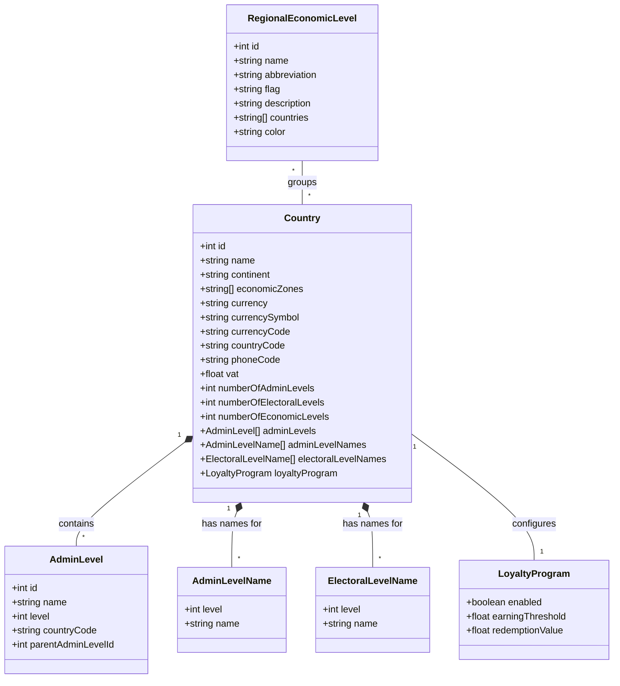
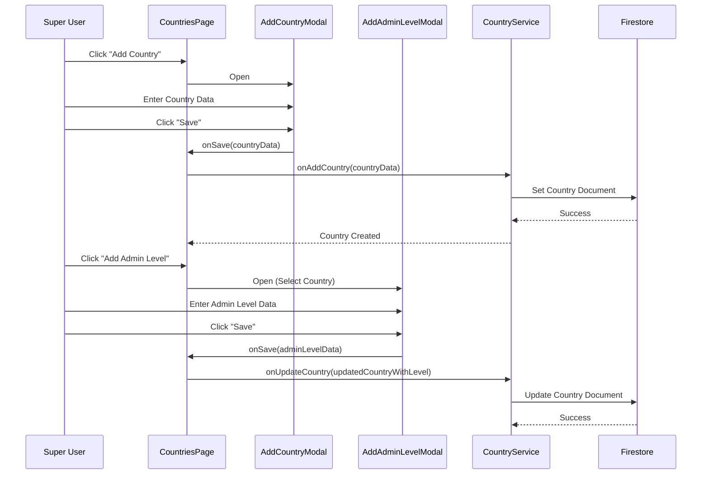
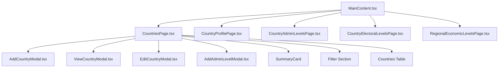

# Countries Management UML Diagrams

This document provides UML diagrams for the "Countries Management" system, designed to guide implementation and understanding of the module.

## 1. Use Case Diagram

The Use Case diagram illustrates how different actors (Admins, Super Users) interact with country-related data and configurations.

```mermaid
useCaseDiagram
    actor "Super User" as SU
    actor "Administrator" as Admin

    package "Countries Management" {
        usecase "View Countries List" as UC1
        usecase "Add New Country" as UC2
        usecase "Edit Country Details" as UC3
        usecase "Delete Country" as UC4
        usecase "Manage Admin Levels" as UC5
        usecase "Manage Electoral Levels" as UC6
        usecase "Manage Regional Economic Levels" as UC7
        usecase "View Country Profile" as UC8
        usecase "Configure Loyalty Program" as UC9
    }

    SU --> UC1
    SU --> UC2
    SU --> UC3
    SU --> UC4
    SU --> UC5
    SU --> UC6
    SU --> UC7
    SU --> UC8
    SU --> UC9

    Admin --> UC1
    Admin --> UC8
```

## 2. Class Diagram

The Class diagram defines the primary data models and their hierarchical relationships, specifically focusing on the nesting of administrative and economic levels.



## 3. Sequence Diagram: Creating a Country and its Admin Levels

This diagram shows the process of adding a new country and subsequently defining its administrative hierarchy.



## 4. Component Architecture

The hierarchy of components involved in the Countries management module.



## 5. Database Schema (Firestore)

The Firestore organization for country data.

- **countries**: `{ id, name, continent, economicZones[], currency, countryCode, vat, adminLevels[], adminLevelNames[], electoralLevelNames[], loyaltyProgram: {}, ... }`
- **regionalEconomicLevels**: `{ id, name, abbreviation, flag, description, countries[] }`
