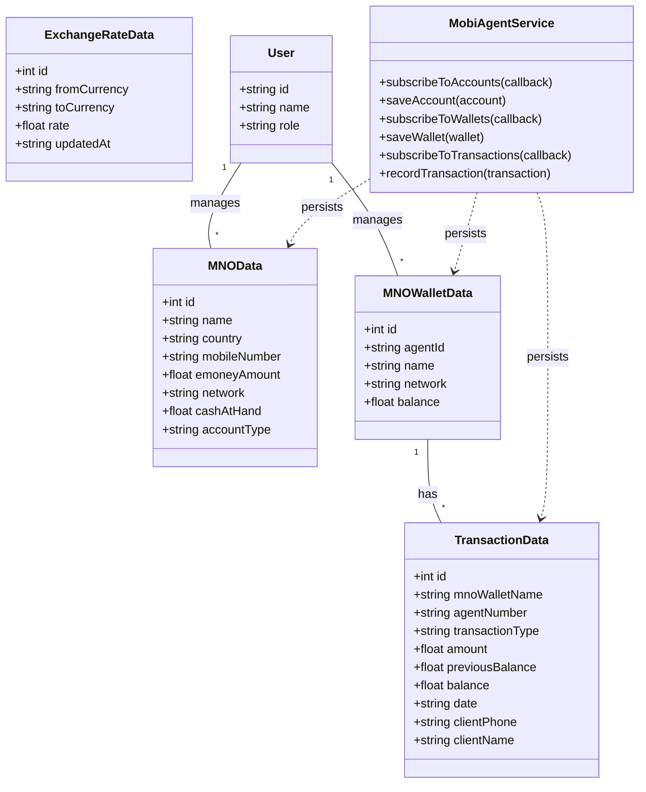
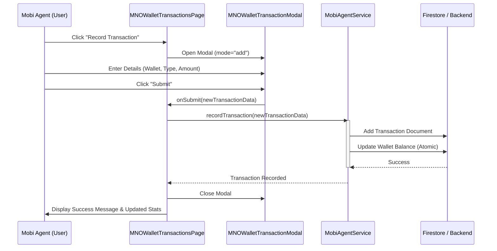
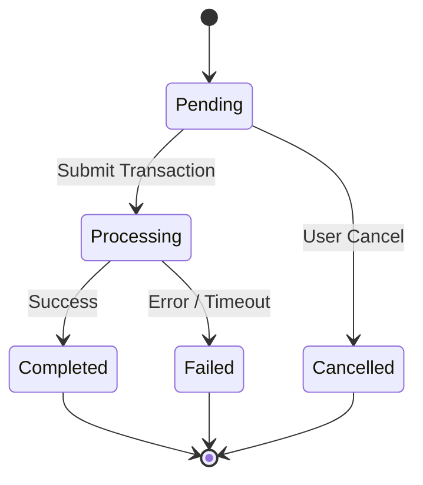
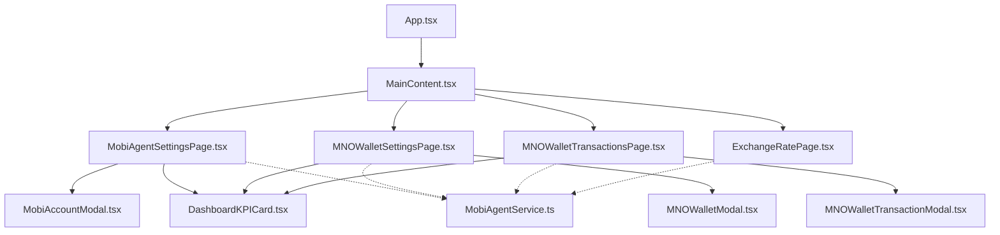

# Mobi Agent Feature UML Diagrams

This document provides UML diagrams for the "Mobi Agent" feature, designed to guide software engineers in its implementation from start to finish.

## 1. Use Case Diagram

The Use Case diagram illustrates the interactions between the Mobi Agent (user) and the system's core functionalities, including potential external integrations.

```mermaid
useCaseDiagram
    actor "Mobi Agent" as Agent
    actor "MNO System" as MNO
    actor "Admin" as Admin

    package "Mobi Agent Feature" {
        usecase "Manage MNO Accounts" as UC1
        usecase "Manage Cash at Hand" as UC2
        usecase "Manage MNO Wallets" as UC3
        usecase "Record Transactions" as UC4
        usecase "View Transaction History" as UC5
        usecase "Manage Exchange Rates" as UC6
        usecase "View Dashboard Stats" as UC7
        usecase "Assign Mobi Agent Role" as UC8
    }

    Agent --> UC1
    Agent --> UC2
    Agent --> UC3
    Agent --> UC4
    Agent --> UC5
    Agent --> UC6
    Agent --> UC7
    
    Admin --> UC8

    UC4 ..> MNO : "Optional API Integration"
```

## 2. Class Diagram

The Class diagram defines the data structures, their properties, and their relationships.



## 3. Sequence Diagram: Recording a Transaction

This diagram shows the end-to-end process of recording a transaction, including state updates and persistence.



## 4. State Machine Diagram: Transaction Lifecycle

This diagram illustrates the possible states of a transaction from initiation to completion.



## 5. Component Architecture

A high-level view of the frontend component hierarchy and data flow.



## 6. Database Schema (Firestore)

Recommended collection structure for the Mobi Agent feature.

- **mnoAccounts**: `{ id, name, country, mobileNumber, emoneyAmount, network, accountType, userId }`
- **mnoWallets**: `{ id, agentId, name, network, balance, userId }`
- **mnoTransactions**: `{ id, walletId, mnoWalletName, agentNumber, transactionType, amount, previousBalance, balance, date, clientPhone, clientName, userId }`
- **exchangeRates**: `{ id, fromCurrency, toCurrency, rate, updatedAt }`
